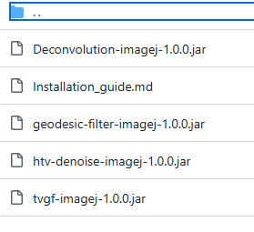
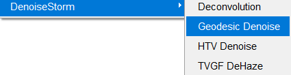
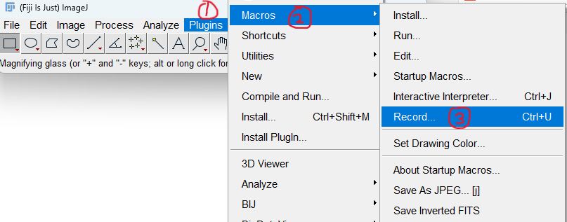
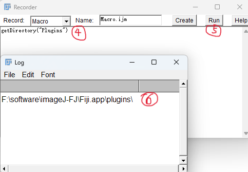

#### 1.Download those 4 .jar files.

#### 2.Drag those 4 jar into the plugins directory of ImageJ and restart ImageJ.

#### 3.ImageJ->Process->DenoiseStorm:

#### supplementary:The plugins directory of ImageJ.

